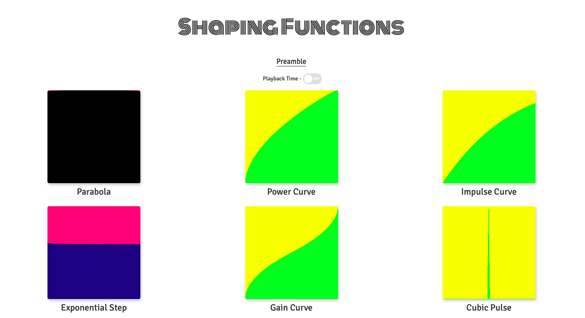

# Shaping Functions

**Shaping Functions** are the mathematical functions used in crafting shapes, for example - plotting a line using [linear interpolation]().
Application of these functions includes animating shapes, developing envelopes for music or controlling the flow of values in shaders.

## Example

Given below is a visualisation of a mathematical function called **Impulse curve**

```glsl
float impulse(float k, float x) {
  float h = k * x;
  return h * exp(1.0 - h);
}
```

<p align="center">
  
</p>

Inspired by [The Book of Shaders](https://thebookofshaders.com), I created some shaders to visualise the shaping functions. You can play with them [here](https://shaping-functions.surge.sh).

<p align="center">
  
</p>

## Resources

* [Inigo Quilez's Blog](http://www.iquilezles.org/www/index.html) -  His blog explains the use cases for different shaping functions, rendering techniques and some math that you will find useful when working with shaders.

* [Kynd's Curves](https://www.flickr.com/photos/kynd/9546075099) - Representation of various math functions. 